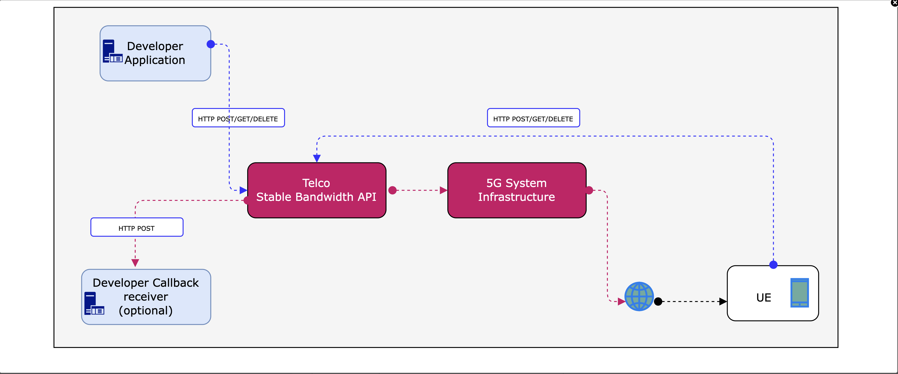

# Overview

Telco QoS solution is element of modern 4G/5G Operator Networks deployments and based on well defined architectural framework.
The QoS framework which is described by 3GPP spec elements and define components such as PDU Session, App/QoS Flows, Packet Filters and many others [].

The Quality-On-Demand (QoD) API for Stable Bandwidth abstracts those detailed internals of QoS Telco framework, and provides to Developers and other Users
interface to manage Bandwidth provided by Telco networks without necessity to have in-depth knowledge of the 5G System complexity.

## Introduction

The API offers the Application Developers and Users to request for stable Bandwidth "class" for required transferred data size volumes between
Application Clients and backend Services.
Similarly to QoD Latency API, prioritisation of data communication links (App-Flows) is applied:

* Ability to prioritise an Data Communication links (App-Flows) to ensure requested bandwidth within the single App-Flow of the Application,
* Prioritise each App-Flow to ensure requested bandwidth of the Application,
* Choosing between different QoS Profiles of Bandwidth classes (e.g. Small ,Medium, Large) for the App-Flow.

Once proper QoS Bandwidth class is requested, Application users get a prioritised service even in the case of congestion.
The API will be used by Application developers to integrate traffic policies which can be defined statically or dynamically by Users
to choose between Bandwidth classes to get a service more tailored for their specific use case.

## Quick Start

The usage of the stable bandwidth API is based on Telco QoS sessions (abstracted by the API), QoS Bandwidth Classes and input parameters which define data communication links.
Within the CAMARA QoD Bandwidth API, QoS session can be created, queried and deleted and appropriate QoS bandwidth classes specified to ensure requested "Bandwidth".
CAMARA community for the purpose of the QoD API will define some sample QoS profiles classes but in real production those might vary and defined
according to Operators specification and requirements, technology, internal policy etc.

The Stable Bandwidth API follows common design assumptions [] based on REST (resource predictable URL's, JSON-encoded responses, response codes, etc).

## Authentication and Authorization

It can be assumed that Authentication and Authorization method might differ among final implementations and be specific to operator and vendor technology.
For the purpose of the CAMARA, the authentication against the 5G latency API is done using the HTTP Header field key, and "Authorization" with the API key that will provided by the CAMARA Integrator.

## API Documentation

### Details

The *Application Developer* uses the stable Bandwidth *API*  to control the bandwidth of the 5G network App-Flows/QoS sessions provided
to Applications running on *User Equipment (UE)* mobile terminals\*.\*

Following diagram shows the interaction of the different components.

* Telco QoD Bandwidth API component which plays role of Telco Network Exposure to Application Developers and Users (UE terminals),
* 5G System Infrastructure, which provides QoS architectural and technological solution used by the QoD Latency API.

Details how CAMARA QoS Bandwidth profiles maps into Telco Operator QoS classes might differ but sample blueprint
proposed by the CAMARA is agreed [].
Following QoS-Bandwidth spec is defined to enable API user (Developer) to request QoS Bandwidth class profile.

| **QoD Bandwidth Profile** | **Details** |
| --------------------- | ------- |
| THROUGHPUT\_S | Small class of throughput profile - for example DL (Downlink) up-to 10Mbps |
| THROUGHPUT\_M | Medium class of throughput profile - for example DL (Downlink) up-to 30Mbps |
| THROUGHPUT\_L | Large class of throughput profile - for example DL (Downlink) up-to 100Mbps |
 
### Endpoint-Definitions

The example Base-URL RESTful Stable Bandwidth API endpoint is [[https://application-server.com/5g-throughput\](https://application-server.com/5g-throughput)](https://application-server.com/5g-throughput](https://application-server.com/5g-throughput)). 
Following table defines API endpoints of exposed REST based for QoD Bandwidth management operations. 

| **Endpoint** | **Operation** | **Description** |
| -------- | --------- | ----------- |
| POST   \<base-url>/qos-senf/v1/sessions | **Create Bandwidth  Session** |  Create QoS Session to manage bandwidth priorities |
| GET  \<base-url>/qos-senf/v1/sessions/{sessionId} | **Query for Bandwidth** | Querying for QoS "bandwidth" session information details |
| DELETE  \<base-url>/qos-senf/v1/sessions/{sessionId} | **Delete Bandwidth  Session** | Deleting a QoS "bandwidth" session |
 
#### **QoD Create Bandwidth QoS Session Operation**
 
| **Create Bandwidth QoS Session** |
| ---------------------------- |
| **HTTP Request**  POST \<base-url>/qos-senf/v1/sessions **Query Parameters**  No query parameters are defined. **Path Parameters**  No path parameters are defined. **Request Body Parameters**  **duration (optional)**: Session duration in seconds. Maximal value of 24 hours is used if not set.  **ueAddr:** The IPv4 address of the user equipment. It can contain a single IP address or a range, using a mask.   Format: \<address>[/\<mask>]    - address : an IPv4 number in dotted-quad form 1.2.3.4. Only this exact IP number will match the flow control rule.    - address/mask : an IP number as above with a mask width of the form 1.2.3.4/24.     *In this case, all IP numbers from 1.2.3.0 to 1.2.3.255 will match. The bit width MUST be valid for the IP  version.*  **asAddr:** The IPv4 address of the application server. It can contain a single IP address or a range, using a mask.    **uePort (optional):** A list of single ports or port ranges on the user equipment.   Ports may be specified as <\{port\|port\-port\}\[\,ports\[\,\.\.\.\]\]\>\.    The '-' notation specifies a range of ports (including boundaries).    Example: '5010-5020,5021,5022'  **asPort (optional):** A list of single ports or port ranges on the application server.  **protocolIn:** The used transport protocol for the uplink.   TCP - TCP protocol   UDP - UDP protocol   ANY - all protocols  **protocolOut :** The used transport protocol for the downlink.   TCP - TCP protocol   UDP - UDP protocol   ANY - all protocols  **qos:** Qualifier for the requested throughput profile.   THROUGHPUT\_S - Downlink up to 20Mbps   THROUGHPUT\_M - Downlink up to 50Mbps   THROUGHPUT\_L - Downlink up to 100Mbps  **notificationUri (optional):** URI of the callback receiver. Allows asynchronous delivery of session related events . &nbsp; Example: '[https://application-server.com/notifications](https://application-server.com/notifications)'  **notificationAuthToken (optional):** Authentification token for callback API.   Example: 'c8974e592c2fa383d4a3960714'  **Response**  **201: Session created**   Response body:    **duration:** Session duration in seconds.    **ueAddr:** The ipv4 address of the user equipment.    **asAddr:** The ipv4 address of the application server.    **uePort (optional):** The requested port(s) on the user equipment.    **asPort (optional):** The requested port(s) on the user equipment.    **protocolIn:** The used transport protocol for the uplink.    **protocolOut:** The used transport protocol for the downlink.    **qos:** Qualifier of the requested throughput profile.    **notificationUri (optional):** URI of the callback receiver.    **notificationAuthToken (optional):** Authentication token for callback API.    **id:** Session ID in UUID format.     Example: 123e4567-e89b-12d3-a456-426614174000    **startedAt:** Timestamp of session start in seconds since unix epoch.     Example: 1639479600    **expiresAt**: Timestamp of session expiration if the session was not deleted in seconds since unix epoch.   **400:** **Invalid input.**  **401:** **Un-authorized, missing or incorrect authentication.**  **405:** **Invalid input**  **500:** **Session not created**  **503:** **Service temporarily unavailable** |
 
 
#### **QoD Query for Bandwidth QoS Session**

| **Quering QoS Session Bandwidth information** |
| ----------------------------------------- |
| **HTTP Request**  GET\<base-url>/qos-senf/v1/sessions/{sessionId} **Query Parameters**  No query parameters are defined. **Path Parameters**  sessionId: Session id that was obtained from the Create QoS Session operation. **Request Body Parameters**  No request body parameters are defined. **Response**   **200: Session information returned.**   Response body:    **duration:** Session duration in seconds.    **ueAddr:** The ipv4 address of the user equipment.    **asAddr:** The ipv4 address of the application server.    **uePort (optional):** The requested port(s) on the user equipment.    **asPort (optional):** The requested port(s) on the user equipment.    **protocolIn:** The used transport protocol for the uplink.    **protocolOut:** The used transport protocol for the downlink.    **qos:** Qualifier of the requested throughput profile.    **notificationUri (optional):** URI of the callback receiver.    **notificationAuthToken (optional):** Authentication token for callback API.    **id:** Session ID in UUID format.    **startedAt:** Timestamp of session start in seconds since unix epoch.    **expiresAt:** Timestamp of session expiration if the session was not deleted in seconds since unix epoch.   **401:** Un-authorised, missing or incorrect authentication.  **404:** Session not found.  **503:** Service temporarily unavailable. |
 
 
#### QoD Delete Bandwidth QoS Session
 
| **Deleting QoS Bandwidth session** |
| ------------------------------ |
| **HTTP Request**   DELETE\<base-url>/qos-senf/v1/sessions/{sessionId} **Query Parameters**   No query parameters are defined. **Path Parameters**   sessionId: Session ID that need to terminated. **Request Body Parameters**   No request body parameters are defined.  **Response**  **204:** Session deleted  **401:** Un-authorized, missing or incorrect authentication.  **404:** Session not found |
 
 
## **Errors**
 
Since CAMARA QoD API is based on REST design principles and blueprints, well defined community HTTP defined status
codes and families are followed [[https://restfulapi.net/http-status-codes/](https://restfulapi.net/http-status-codes/)] .
Details of HTTP based error/exception codes for the QoD API are described Section 5.2 of each API REST based method.

## **Policies**

N/A

## **Code Snippets**

N/A

## **FAQ's**

N/A

## **Terms**

N/A

## **Release Notes**

N/A

 
 
